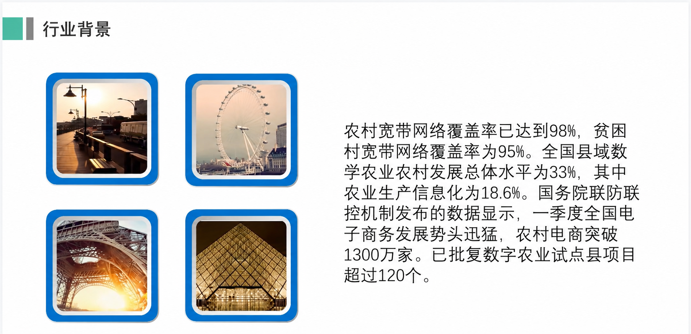
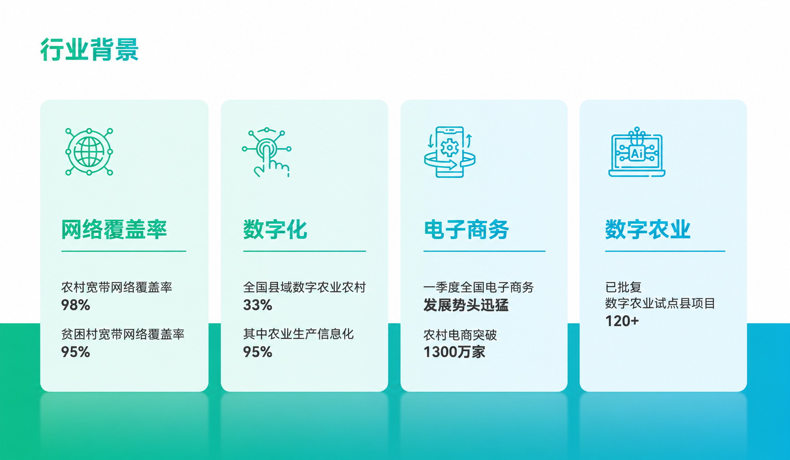
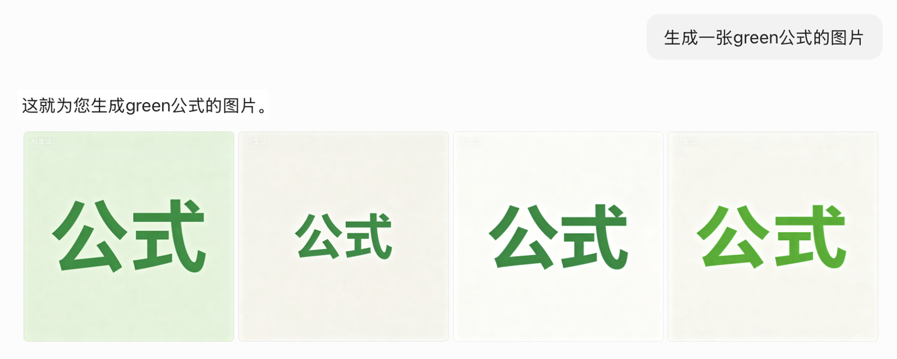
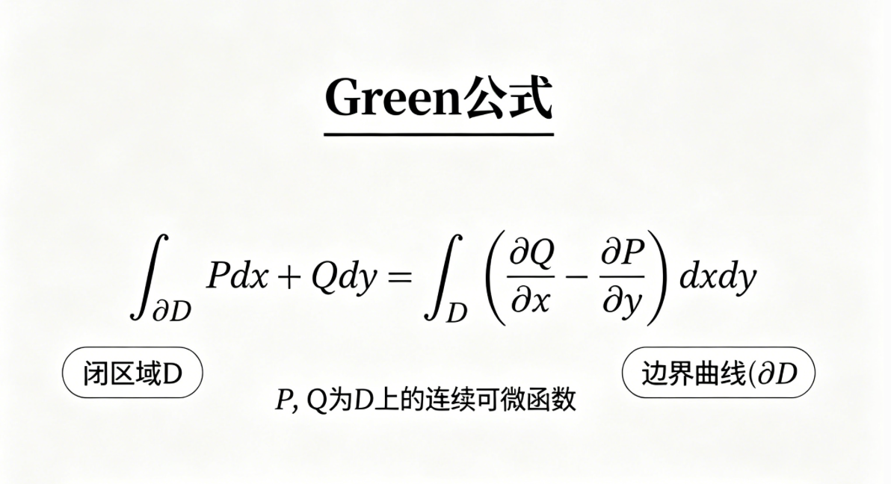

```{=html}
<style>
.tutorial-hero {
  display: grid;
  grid-template-columns: minmax(0, 1.2fr) minmax(280px, 0.8fr);
  gap: 28px;
  align-items: center;
  margin: 14px 0 34px;
  padding: 28px;
  border: 1px solid #d8e5e3;
  border-radius: 8px;
  background: linear-gradient(135deg, #ffffff 0%, #eef8f5 100%);
}

.tutorial-hero h2 {
  margin-top: 10px;
  font-size: clamp(2rem, 4vw, 3.4rem);
  line-height: 1.12;
  letter-spacing: 0;
}

.eyebrow {
  display: inline-flex;
  width: fit-content;
  padding: 5px 10px;
  border-radius: 999px;
  color: #0c6f63;
  background: #dff4ef;
  font-size: 0.78rem;
  font-weight: 800;
}

.hero-lead {
  color: #415161;
  font-size: 1.08rem;
  line-height: 1.8;
}

.quick-map,
.prompt-box,
.checklist-box {
  margin: 24px 0;
  padding: 20px;
  border: 1px solid #dbe2ea;
  border-radius: 8px;
  background: #fbfcff;
}

.quick-map strong,
.prompt-box strong,
.checklist-box strong {
  color: #17212f;
}

.step-grid,
.principle-grid,
.example-grid,
.diagnosis-grid,
.workflow-strip {
  display: grid;
  grid-template-columns: repeat(2, minmax(0, 1fr));
  gap: 16px;
  margin: 22px 0;
}

.step-card,
.principle-card,
.example-card,
.diagnosis-card,
.workflow-card {
  padding: 18px;
  border: 1px solid #dbe2ea;
  border-radius: 8px;
  background: #ffffff;
}

.diagnosis-card {
  border-top: 4px solid #2d8f85;
}

.diagnosis-card:nth-child(2) {
  border-top-color: #d99b2b;
}

.diagnosis-card:nth-child(3) {
  border-top-color: #d8624a;
}

.diagnosis-card:nth-child(4) {
  border-top-color: #5266b1;
}

.step-card h3,
.principle-card h3,
.example-card h3,
.diagnosis-card h3,
.workflow-card h3 {
  margin-top: 0;
  font-size: 1.15rem;
}

.step-number {
  display: inline-flex;
  align-items: center;
  justify-content: center;
  width: 34px;
  height: 34px;
  margin-bottom: 12px;
  border-radius: 8px;
  color: #ffffff;
  background: #17212f;
  font-weight: 800;
}

.prompt-box pre {
  margin-bottom: 0;
  border-radius: 8px;
}

.figure-panel {
  margin: 26px 0;
}

.figure-panel img {
  width: 100%;
  border: 1px solid #dbe2ea;
  border-radius: 8px;
  background: #ffffff;
}

.figure-panel figcaption {
  margin-top: 8px;
  color: #647486;
  font-size: 0.92rem;
  line-height: 1.6;
  text-align: center;
}

.practice-compare {
  display: grid;
  grid-template-columns: repeat(2, minmax(0, 1fr));
  gap: 16px;
  margin: 26px 0;
}

.practice-shot {
  overflow: hidden;
  border: 1px solid #dbe2ea;
  border-radius: 8px;
  background: #ffffff;
}

.practice-shot img {
  display: block;
  width: 100%;
}

.practice-shot figcaption {
  padding: 12px 14px;
  color: #415161;
  font-size: 0.92rem;
  line-height: 1.6;
  border-top: 1px solid #dbe2ea;
  background: #fbfcff;
}

.table-note {
  margin: 24px 0;
}

.table-note table {
  width: 100%;
  font-size: 0.94rem;
}

.table-note th {
  white-space: nowrap;
}

.hero-contrast {
  display: grid;
  gap: 14px;
  padding: 18px;
  border: 1px solid #ccdce7;
  border-radius: 8px;
  background:
    linear-gradient(180deg, rgba(255, 255, 255, 0.92), rgba(255, 255, 255, 0.98)),
    radial-gradient(circle at 18% 18%, rgba(216, 98, 74, 0.16), transparent 32%),
    radial-gradient(circle at 82% 72%, rgba(45, 143, 133, 0.18), transparent 34%);
}

.contrast-card {
  padding: 16px;
  border-radius: 8px;
  border: 1px solid #dbe2ea;
  background: #ffffff;
}

.contrast-card h3 {
  margin: 0 0 10px;
  font-size: 1.02rem;
}

.contrast-card ul {
  margin: 0;
  padding-left: 1.1rem;
}

.contrast-card li {
  margin: 6px 0;
  color: #415161;
  line-height: 1.55;
}

.contrast-card.bad {
  border-top: 4px solid #d8624a;
  background: #fff8f5;
}

.contrast-card.good {
  border-top: 4px solid #2d8f85;
  background: #f4fbf8;
}

.contrast-arrow {
  display: flex;
  align-items: center;
  justify-content: center;
  min-height: 38px;
  color: #0c6f63;
  font-weight: 900;
}

.diagram-note {
  margin: 4px 0 0;
  color: #647486;
  font-size: 0.92rem;
  font-weight: 400;
  line-height: 1.6;
}

.before-after,
.do-dont {
  display: grid;
  grid-template-columns: repeat(2, minmax(0, 1fr));
  gap: 16px;
  margin: 20px 0;
}

.before,
.after,
.do,
.dont {
  padding: 18px;
  border-radius: 8px;
  border: 1px solid #dbe2ea;
}

.before,
.dont {
  background: #fff6f2;
}

.after,
.do {
  background: #f0f8f4;
}

.tagline {
  margin: 8px 0 0;
  color: #647486;
  font-size: 0.94rem;
  line-height: 1.65;
}

@media (max-width: 800px) {
  .tutorial-hero,
  .hero-contrast,
  .step-grid,
  .principle-grid,
  .example-grid,
  .diagnosis-grid,
  .workflow-strip,
  .practice-compare,
  .before-after,
  .do-dont {
    grid-template-columns: 1fr;
  }

  .tutorial-hero {
    padding: 20px;
  }
}
</style>
```

::: {.tutorial-hero}
::: {}

## AI 不应该替你思考，而应该放大你的思考

先有人的判断，再有 AI 的效率。

:::

::: {.hero-contrast}
::: {.contrast-card .bad}
### 把思考外包给 AI

- 资料没核验
- 观点像平均答案
- 页面堆满文字
:::

::: {.contrast-arrow}
先有人的判断，再让 AI 加速
:::

::: {.contrast-card .good}
### 带着框架和 AI 协作

- 人先定观点
- AI 优化表达
- 工具生成 PPT 初稿
- 人再做取舍
:::
:::
:::

## 先看一个真实效果：同一段材料，为什么一页像草稿，一页像 PPT？

同一段“行业背景”材料，直接塞进页面是草稿；先拆结构，再让 AI 辅助排版，才像 PPT。

::: {.practice-compare}
<figure class="practice-shot">
  
  <figcaption><strong>直接堆材料：</strong>图片像装饰，文字像资料原文，听众很难在几秒内抓到重点。</figcaption>
</figure>

<figure class="practice-shot">
  
  <figcaption><strong>先拆结构再排版：</strong>把材料拆成网络覆盖率、数字化、电子商务、数字农业四个模块，页面才变得可讲、可看、可记。</figcaption>
</figure>
:::

这就是本文的基本立场：人决定讲什么，AI 帮你讲得更清楚。

## 先划清边界：AI 能帮忙，但不能替你想

最危险的用法，是把“我还没想清楚”直接交给 AI。它当然可以生成一份看起来完整的 PPT，但这份 PPT 往往只是平均答案：论点松散、资料未经核验、例子听起来正确却不一定适合你的课堂展示。

更好的用法，是先把人的思考写出来，再让 AI 做加工。

::: {.before-after}
::: {.before}
### 不推荐：把思考外包

帮我做一个关于提示词工程的 PPT，要高级一点，内容丰富一点。
:::

::: {.after}
### 推荐：带着自己的框架协作

我已经查了资料，并初步确定展示主线：提示词工程可以理解为给 AI 补足语用语境。我的大纲是：引入案例、共同语境、Grice 四准则、PPT 工作流、总结。请不要替我重写主题，而是帮我检查逻辑跳跃、补充每页可用案例，并把它整理成 8 页 PPT 细纲。
:::
:::

这两个请求的差别不只是长度。后者明确告诉 AI：主题由人决定，结构由人先搭，AI 的职责是检查、补充和优化。这样产出的 PPT 才不会像“生成内容”，而更像“把你的想法做成更好的表达”。

所以提示词工程可以理解成：

$$
P(y \mid x)
$$

其中 `x` 是你给出的提示词、资料、观点、大纲和约束，`y` 是模型生成的结果。`x` 里如果没有人的判断，`y` 就只能靠概率平均；`x` 里有清楚的思考，AI 才能围绕你的方向继续加工。

::: {.callout-note}
语用学关心的是“话在具体语境中是什么意思”。提示词工程关心的是“怎样把这个语境写清楚，让 AI 能按你的意思工作”。两者的交集，就是把人的思考、资料来源、概念边界和表达目标显性化。
:::

## 用 Grice 四准则诊断提示词

Grice 的合作原则原本解释人类对话为什么能互相理解。换到 AI 协作里，它可以变成一张非常实用的提示词检查表。

::: {.principle-grid}
::: {.principle-card}
### 质的准则：真实吗？

不要让 AI 为了迎合你而编造。好的提示词要允许它说“不确定”，并要求它先检查问题前提。
:::

::: {.principle-card}
### 关系准则：相关吗？

同一个词在不同语境里可能完全不同。提示词要告诉 AI 现在属于哪门课、哪个领域、哪种任务。
:::

::: {.principle-card}
### 量的准则：够用吗？

给太少，AI 会猜；给太多，AI 会抓不住重点。关键是给“足够完成任务”的信息。
:::

::: {.principle-card}
### 方式准则：清楚吗？

避免黑话、反讽、缩写和含糊代词。能拆成列表，就不要写成一大段情绪化要求。
:::
:::

::: {.table-note}
| Grice 准则 | Prompt 里要补什么 | 做 PPT 时的具体问题 |
|---|---|---|
| 质的准则 | 事实来源、前提检查、不确定性 | 这个例子是真的吗？有没有让 AI 顺着错误前提编？ |
| 关系准则 | 课程语境、领域限定、主题边界 | 这一页和主题有关吗？关键词有没有被 AI 理解错？ |
| 量的准则 | 必要细节、输出长度、页面密度 | 页面信息够不够？是不是把讲稿全塞进幻灯片？ |
| 方式准则 | 清晰格式、少歧义、解释黑话 | prompt 是否可执行？缩写、反讽、圈内话有没有说明？ |
:::

## 四个案例：把翻车点改成提示词策略

下面不是单纯列模板，而是用语用学去诊断 AI 为什么会出错。每个案例都可以迁移到做 PPT 的过程中。

::: {.diagnosis-grid}
::: {.diagnosis-card}
### 质的准则：先查前提

**AI 翻车表现：** 你问“为什么隧道上通常会修建一座山”，AI 可能顺着问题解释，好像这个前提本身一定成立。

**语用学解释：** 人类听众可能会追问“你是不是把因果关系说反了”；AI 如果只追求顺畅回答，就可能忽略真实性。

**Prompt 修正：** “请先判断我的问题前提是否成立。如果前提不成立，请指出问题在哪里，再给出更合理的解释。”
:::

::: {.diagnosis-card}
### 关系准则：限定领域

**AI 翻车表现：** 让 AI “生成一张关于 Green 公式的图片”，它可能画出绿色的数学公式，而不是 George Green 相关的数学概念。

**语用学解释：** `Green` 对人类课堂同学可能是明确的专业词，但对 AI 来说，它同时连接颜色、人名、环保、品牌和数学。

**Prompt 修正：** “这里的 Green 指数学家 George Green，不是绿色。请在数学分析/向量分析语境下处理这个概念。”
:::

::: {.diagnosis-card}
### 量的准则：细节服务目标

**AI 翻车表现：** “画一张滑雪的图片”大概率得到普通人物和普通雪山；“帮我美化 PPT”也常得到通用模板。

**语用学解释：** 少量提示会让 AI 走向平均值。想要定制化，就要补足主体、动作、环境、构图、风格和使用场景。

**Prompt 修正：** “男性双板滑雪者、红色滑雪服、陡坡高速滑行、雪雾飞溅、湛蓝天空、高清超写实、动感构图。”做 PPT 也同理：把“高级”拆成配色、布局、图文比例和信息密度。
:::

::: {.diagnosis-card}
### 方式准则：翻译圈内话

**AI 翻车表现：** “这门课不是 non-trivial 到爆了吧”“萝卜熟了”“老鼠尾巴”这类表达，如果不解释，AI 可能按字面理解。

**语用学解释：** 黑话依赖圈内共同经验。对同学来说是默契，对 AI 来说是没有说明来源的歧义。

**Prompt 修正：** “下面有一些课程/竞赛/医学圈内表达，请先按我给的定义理解，不要按字面解释。”然后列出缩写和含义。
:::
:::

### 实践效果 1：Green 公式不是“绿色公式”

关系准则的问题，用图片最直观。只说“生成一张 green 公式的图片”，AI 可能抓住的是 `green = 绿色`，而不是课程语境里的 `Green = George Green`。

::: {.practice-compare}
<figure class="practice-shot">
  
  <figcaption><strong>缺少领域语境：</strong>AI 把关键词按字面理解，生成了“绿色的公式”。</figcaption>
</figure>

<figure class="practice-shot">
  
  <figcaption><strong>补上数学语境：</strong>说明 Green 指数学家 George Green，输出才会靠近真正的课程内容。</figcaption>
</figure>
:::

### 实践效果 2：细节不是堆字，而是减少 AI 的盲猜

“画一张滑雪的图片”和“男性双板滑雪者、红色滑雪服、陡坡高速滑行、雪雾飞溅、湛蓝天空、高清超写实、动感构图”得到的不是同一种结果。细节的作用，是让 AI 少猜一点，让画面更接近你脑子里的用途。

<figure class="figure-panel">
  
  <figcaption>当主体、动作、环境和构图都被写清楚时，图片就不再只是“一个人在滑雪”，而是可以直接作为 PPT 背景或案例图的视觉素材。</figcaption>
</figure>

## 一套可复用的 7 步人机协作流程

一次性让 AI 从 0 到 100 做完整 PPT，最大的问题不是“不稳定”，而是会让人跳过真正重要的思考。更好的流程是：前半段由人完成研究和立论，后半段让 AI 提高表达效率。

::: {.workflow-strip}
::: {.workflow-card}
<span class="step-number">1</span>

### 查找资料

先自己读材料、筛资料、记来源。AI 可以帮你整理摘要，但不能替你判断哪些材料值得信。
:::

::: {.workflow-card}
<span class="step-number">2</span>

### 写大纲

先用自己的话写出主题、核心观点和讲述顺序。这个阶段决定 PPT 有没有灵魂。
:::

::: {.workflow-card}
<span class="step-number">3</span>

### 写细纲

把大纲拆到每一页：这一页讲什么、用什么例子、听众要记住什么。
:::

::: {.workflow-card}
<span class="step-number">4</span>

### AI 润色成 prompt

把你的资料和细纲交给 AI，让它补足语境、输出格式和视觉要求。
:::

::: {.workflow-card}
<span class="step-number">5</span>

### 生成 PPT 初稿

用 Gamma、PPT 工具或其他 AI 工具生成初稿，但只把它当作可修改的草稿。
:::

::: {.workflow-card}
<span class="step-number">6</span>

### 改排版和图片

人继续检查页面逻辑、删掉多余文字、替换不准确或太“AI 味”的图片。
:::

::: {.workflow-card}
<span class="step-number">7</span>

### 增加动画和演示节奏

最后再做动画、转场和讲述节奏。动画服务理解，不负责掩盖内容问题。
:::
:::

::: {.table-note}
| 步骤 | 人先完成什么 | AI 适合帮什么 | 交付物 |
|---|---|---|---|
| 1. 查资料 | 找资料、记来源、判断可信度 | 摘要、分类、列出争议点 | 资料笔记 |
| 2. 写大纲 | 确定主题、观点、讲述顺序 | 检查逻辑缺口 | 人写的大纲 |
| 3. 写细纲 | 拆分每页内容和例子 | 补充案例、压缩表达 | 每页细纲 |
| 4. 润色 prompt | 写清受众、约束、风格 | 把细纲改成可执行提示词 | 生成 PPT 的 prompt |
| 5. 生成初稿 | 选择工具和模板方向 | 生成页面草稿 | PPT 初稿 |
| 6. 改排版图片 | 判断准确性和审美 | 给出排版/配图修改建议 | 可展示版本 |
| 7. 加动画 | 决定演示节奏 | 优化动画顺序和讲稿 | 最终演示稿 |
:::

## 每一步可以这样让 AI 参与

下面把这次选题真的走一遍。每一步默认折叠，展开后能看到类似 `proposal.docx` / `prompt.docx` 那种阶段性草稿：先是人的想法，再是 AI 帮忙整理后的版本。

### 第一步：查资料

先自己收集材料和案例。这里的重点不是让 AI 搜一遍，而是先判断哪些东西能支撑你的展示。

::: {.prompt-box}
```text
我正在准备一个课堂展示，主题是：[主题]。
下面是我自己查到的资料和链接/笔记：
[贴资料]

请不要替我决定最终观点。请帮我做三件事：
1. 按主题相关性整理资料
2. 标出哪些内容需要进一步核验
3. 提醒我哪些材料适合放进 PPT，哪些只适合作为背景理解
```
:::

::: {.callout-note collapse="true"}
## 实战成果：这一步做完会得到什么？

**人的输入：** 我先把能用的材料记成很粗的素材池：

- 理论：Grice 合作原则，四个准则分别是 Quality / Relevance / Quantity / Manner。
- 引入案例：文字排版前后对比，配图 prompt 前后对比。
- 翻车案例：隧道上为什么修山；Green 公式被理解成绿色公式。
- 视觉案例：滑雪图片，从“画一张滑雪图”到高细节 prompt。
- 总结方向：语言演化，生物语言、人类语言、硅基语言。

**AI/工具参与：** AI 不替我决定主题，只帮我把素材分组，提醒哪些适合放进 PPT，哪些只适合作为背景。

**阶段成果：**

| 素材组 | 可以放进 PPT 的内容 | 用途 |
|---|---|---|
| 引入 | 文字堆叠 vs 结构化排版；普通图片 vs 高细节图片 | 让听众先看到差异 |
| 理论 | 共同语境、先验概率、Grice 四准则 | 解释为什么 prompt 有用 |
| 案例 | 隧道修山、Green 公式、滑雪图、PPT 美化 | 把理论落到具体错误 |
| 工作流 | 查资料、写大纲、写细纲、润色 prompt、生成、修改、动画 | 教大家怎么做 |

实际项目里，我还会把材料和素材文件对应起来：

| 文件/素材 | 内容 | 放到哪一步 |
|---|---|---|
| `proposal.docx` | 最早的逐页想法和案例安排 | 写大纲 |
| `prompt.docx` | 更完整的逐页讲述稿 | 写细纲 |
| `pre.pptx` | 最终 PPT 版本 | 生成和修改 |
| `1.png` / `2.png` | 滑雪图片低维 prompt vs 高维 prompt | 量的准则 |
| `3.png` / `4.png` | PPT 页面改版前后 | 排版优化 |
| `5.png` | 隧道修山问题的回答截图 | 质的准则 |
| `6.png` / `7.png` | Green 公式误解与修正 | 关系准则 |
| `8.png` / `9.png` | 建筑图普通 prompt vs 具体场景 prompt | 配图优化 |
:::

### 第二步：写大纲

大纲先由你写。AI 在这里更像评审：帮你发现逻辑跳跃、主题偏移和信息过载。

::: {.prompt-box}
```text
这是我自己写的 PPT 大纲：
[贴大纲]

请从课堂展示的角度评审它。
重点检查：
- 逻辑顺序是否自然
- 是否有概念跳跃
- 哪些页面信息太散
- 哪些地方需要案例
- 哪一页最可能让听众困惑

请先指出问题，不要直接替我重写。最后给出 3 条修改建议。
```
:::

::: {.callout-note collapse="true"}
## 实战成果：这一步做完会得到什么？

**人的输入：** 我先写一个很像 `proposal.docx` 的粗大纲：

```text
Slide 1: 主题
提示词工程中的语用学——如何用 AI 提高你做 PPT 的效率

Slide 2: 引入
案例 1：文字和排版，一行行文字堆积 vs 结构清晰的要点简述。
案例 2：图片/背景图，随口一句指令 vs 加入光影、构图、材质参数。
总结：背后是提示词工程。

Slide 3: 与 AI 对话 vs 与人类对话
人类有共同语境，AI 没有具体生活经验。
提示词工程就是手动为 AI 注入先验概率。

Slide 4: Cooperative Principle
Quality, Relevance, Quantity, Manner.

Slide 5-8: 四个准则和案例
质：隧道修山；关系：Green 公式；量：滑雪图和 PPT 美化；方式：圈内黑话。

Slide 9: 实操展示
用上面的准则生成、排版、修改 PPT。

Slide 10-11: 总结
语言演化的三个纪元；技术和语言的共生演化。

Slide 12: Reference
列出参考资料链接。

Slide 13: Thanks
结束页，放个人网站或致谢。
```

**AI/工具参与：** AI 只做评审：指出 Slide 10-11 可能太宏观，应该压缩；Slide 9 最好不要只说“实操展示”，而要展开成具体步骤。

**阶段成果：** 得到一个顺序更清楚的大纲：先用效果对比抓住注意力，再讲语用学理论，最后进入 PPT 工作流。
:::

### 第三步：写细纲

把大纲拆到每一页。每页只回答一个问题：这一页要让听众记住什么？


::: {.prompt-box}
```text
下面是我修改后的 PPT 细纲：
[贴每页细纲]

请基于这个细纲，为每一页补充：
- 页面标题：不超过 14 个字
- 页面正文：不超过 3 个要点
- 讲述提示：80-120 字
- 视觉建议：图表、流程图、对比图或案例截图

要求：
- 不要新增我没有提到的核心论点
- 如果你补充案例，请标明它只是建议，需要我核验
- 页面上不要堆长段文字，把解释放到讲述提示里
```
:::

::: {.callout-note collapse="true"}
## 实战成果：这一步做完会得到什么？

**人的输入：** 我把大纲进一步写成 `prompt.docx` 那种逐页细纲：

```text
Slide 2: 鲜明对比：魔法背后的秘密
反面：丢给 AI 一段话，得到满屏密集文字。
正面：结构清晰的要点简述、图文并茂的排版。
核心问题：决定 AI 产出质量差距的是什么？

Slide 3: 认知对齐：与 AI 对话 vs 与人类对话
人类沟通依赖共同语境和常识。
AI 没有肉身、情绪和课堂经历，只能从输入中猜。
核心论点：提示词工程是在为 AI 注入先验概率。

Slide 4: Recap: Cooperative Principle
Maxim of Quality, Maxim of Relevance, Maxim of Quantity, Maxim of Manner.
作用：把课堂里的语用学概念接到 AI prompt 上。

Slide 5: 质的准则
案例：问 AI “为什么隧道上通常会修建一座山？”
问题：如果问题前提不清，AI 可能顺着错误前提解释。
结论：把 AI 当工具，而不是权威；先检查问题是否成立。

Slide 6: 关系准则
案例：生成一张 Green 公式图片。
问题：AI 可能理解成绿色公式。
结论：不要把局部语境当成 AI 默认知道的常识。

Slide 7: 量的准则
低维 prompt：“画一张滑雪的图片。”
高维 prompt：主体、动作、环境、光线、构图全部写清楚。
PPT 排版同理：把“高级一点”拆成具体版式要求。

Slide 8: 方式准则
案例：non-trivial、老鼠尾巴、萝卜熟了这类圈内表达。
问题：圈内人听得懂，AI 可能按字面理解。
结论：prompt 里要解释缩写、黑话和隐含语气。

Slide 9: 工作流展示
展示怎样从资料、大纲、细纲，到 AI 润色 prompt，再生成和修改 PPT。

Slide 10: 宏观视角
生物语言、人类语言、硅基语言。
共性：用有限符号组合出无限可能。

Slide 11: 共生演化
技术离不开语言的定义，语言也随着技术扩展边界。

Slide 12-13: Reference / Thanks
收束展示。
```

**AI/工具参与：** AI 帮我检查每页是不是只有一个中心观点，并把“页面文字”和“讲稿解释”分开。

**阶段成果：** 每一页都有标题、案例、结论。后面做 PPT 时不再是把资料整段复制进去，而是按页组织表达。
:::

### 第四步：AI 润色成 prompt

如果要用 Gamma 或类似工具，可以让 AI 把你的细纲改写成更适合生成 PPT 的 prompt。

::: {.prompt-box}
```text
请把我的 PPT 细纲整理成一个适合输入到 PPT 生成工具的 prompt。
要求：
- 保留我的主题、观点和页面顺序
- 每页只保留一个中心观点
- 明确页面标题、正文密度、视觉形式和风格
- 风格为清晰、克制、适合课堂展示
- 不要为了好看牺牲概念准确性
```
:::

::: {.callout-note collapse="true"}
## 实战成果：这一步做完会得到什么？

**人的输入：** 我把上面的细纲、受众、展示时长、视觉风格交给 AI。

**AI/工具参与：** AI 把“人看的细纲”改成“工具能执行的 prompt”，像这样：

**阶段成果：**

```text
请生成一份 8-10 页课堂展示 PPT，主题是“提示词工程中的语用学——如何用 AI 提高你做 PPT 的效率”。

内容顺序：
1. 用 PPT 排版前后对比和图片 prompt 前后对比引入。
2. 解释 AI 缺少共同语境，因此提示词需要补足先验概率。
3. 用 Grice 四准则作为诊断框架。
4. 每个准则配一个案例：隧道修山、Green 公式、滑雪图片、圈内黑话。
5. 展示一个人先写大纲、AI 再补充优化的 PPT 工作流。

页面要求：
- 每页只保留一个中心观点。
- 页面文字少，讲稿解释多。
- 可以使用流程图、对比图、卡片式布局。
- 不要新增未经核验的事实。
- 风格清晰、克制、适合课堂展示。
```

同时把图片和页面修改也写成单独 prompt，避免“高级一点”这种空话：

```text
图片 prompt 示例：
男性双板滑雪者，身着鲜艳红色连体滑雪套装，搭配白色安全头盔、橙色镜片滑雪护目镜、黑色防滑手套，背负双肩背包，手持滑雪杖在厚雪陡坡上高速滑行，雪雾飞溅，背景是晴朗湛蓝天空下的巍峨雪山，明亮自然日光，高清超写实，动感张力构图。

页面改版 prompt 示例：
将这张 PPT 页面重设计为现代化科技风信息图表，采用蓝绿色渐变配色与极简商务风格，以白色背景和卡片式布局呈现；将右侧大段文字拆分为“网络覆盖率、数字化、电子商务、数字农业”四个独立模块，保留全部中文内容并突出关键数据。
```
:::

### 第五步：生成 PPT 初稿

把结构化 prompt 放进 Gamma 或其他 PPT 工具，先得到一个可修改的初稿。不要期待它一步到位。

::: {.prompt-box}
```text
请根据上面的结构化 prompt 生成 PPT 初稿。
重点：
- 保留页面顺序
- 每页只放一个中心观点
- 不要自动添加未经核验的事实
- 如果需要图片，用占位建议，不要编造来源
```
:::


### 第六步：改排版和图片

生成 PPT 初稿后，AI 更适合做“设计助理”：指出哪里太挤、哪里图片不贴切、哪里可以改成图示。注意，这一步不是让 AI 改观点，而是让它帮你改善呈现。

::: {.prompt-box}
```text
下面是我生成后的 PPT 页面内容/截图说明：
[贴每页内容或截图描述]

请帮我给出排版和配图修改建议：
1. 哪些页面文字太多，需要拆分或压缩？
2. 哪些页面适合改成流程图、对比图、表格或时间线？
3. 哪些配图太泛、太“AI 味”，应该替换成什么类型的图？
4. 每页保留一个最重要的修改建议，不要重新改我的论点。
```
:::

### 第七步：动画顺序和讲稿优化

最后再处理演示节奏。动画不是装饰，讲稿也不是逐字念 PPT；两者都应该服务听众对逻辑的理解。

::: {.prompt-box}
```text
下面是我的 PPT 页标题和每页核心内容：
[贴页面列表]

请帮我设计演示节奏：
- 每页建议的出现顺序
- 哪些要点适合逐条出现
- 哪些页面不需要动画
- 每页讲稿中需要补充解释、停顿或强调的位置
- 哪些讲稿表达可以压缩得更自然
- 哪些转场可能显得多余

要求：动画要服务理解，不要为了炫技增加复杂效果。
```
:::


## 发布前检查表

::: {.checklist-box}
- 资料是否由你自己读过，并且知道每个关键观点来自哪里？
- 大纲是否先由你自己写出，而不是完全由 AI 生成？
- 每一页是否只有一个主要观点？
- 关键概念是否给了足够语境？
- AI 补充的事实、案例和图片是否已经人工核验？
- 页面文字是否可以继续压缩？
- 视觉建议是否服务内容，而不是只负责好看？
- 配图是否具体、准确，避免只有“AI 味”的装饰图？
- 讲稿是否解释了页面上没有写出来的逻辑？
- 动画顺序和讲稿是否帮助听众理解，而不是单纯炫技或照读页面？
- 是否把圈内话、缩写和容易误解的词解释清楚？
- 最后一轮是否由你决定修改取舍，而不是全盘接受 AI 建议？
:::

## 结语：语言不是包装，而是控制接口

如果把视野拉远一点，语言一直都是人类理解世界、改变世界的接口。生物语言用 A、T、C、G 编码生命；人类语言用有限的词汇组合出思想和文明；今天的 AI 让自然语言又多了一种角色：它开始成为我们调动机器能力的指令系统。

这也是为什么语用学在 AI 时代并没有过时。恰恰相反，当我们和一个没有肉身、没有课堂经历、没有共同生活经验的系统协作时，“语境”变得更重要了。

但语境不是凭空出现的。它来自人的阅读、判断、取舍和表达意图。提示词工程的本质，不是背模板，也不是让 AI 替你完成思考，而是把你已经形成的思考设计成清楚的协作语境。你想得越清楚，AI 才越能成为一个可校准、可检查、可迭代的 PPT 合作者。

## Reference

1. <https://acnll7zntynp.feishu.cn/wiki/QPiOw9B8NiZRslkcz8UcYzmtnlh/>

2. <https://www.bilibili.com/video/BV1kvXzBjEZA/>

3. <https://www.bilibili.com/video/BV1ES4y1T7S6/>

4. <https://www.youtube.com/watch?v=8z5-IlHYZCY/>

5. <https://www.bilibili.com/video/BV1cp4FzQEsu/>
